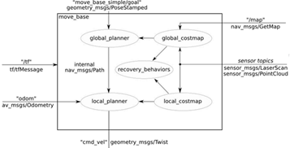
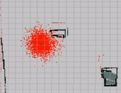
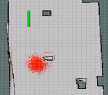

<p align="center">  
   
</p >

# <p align="center">Robotics Project</p >

<p align="center">Professor: Ralph SEULIN</p >  
<p align="center">Students: ZHU Chen,GU Heng</p >  

## Contents
1. [Introduction](#introduction)
2. [Move Robot](#Move-Robot)
3. [Mapping and Localization](#Mapping-and-Localization)
4. [Navigation](#Navigation)
5. [Follow waypoints](#Follow-waypoints)
6. [Conclusion](#Conclusion)

## Introduction
## Move robot
## Mapping and Localization
## Navigation
In order to achieve autonomous navigation of the robot, we need to use a navigation stack. The navigation stack is a set of ROS nodes and algorithms that are used to automatically move the robot from one point to another, thereby avoiding all obstacles that the robot may encounter.  

<p align="center">  
   
</p >  

In order to realize the path planning of the robot, we need to use the 2D Nav target tool of the mobile robot, costmap, and calculate the trajectory. In order to achieve these goals, we need to use the move_base package. The move_base package contains the move_base node.  The move_base node is one of the major elements in the ROS Navigation Stack, since it links all of the elements that take place in the Navigation process. As shown below:  

<p align="center">  
   
</p >  

The move_base node implements SimpleActionServer and receives target information with geometry_msgs/PoseStamped messages. The following table describes the description of some topics subscribed and published by the move_base node.  

<p align="center">  
   
</p >   

If we need the robot to avoid obstacles to reach the designated place, we also need to use the following parameters:  
- **The Global Planner:** When the move_base node receives a new target, the target will be sent to the global planner immediately. Then, the global planner is responsible for calculating the safe path to reach the target posture. The path is calculated before the robot starts to move, so readings made by the robot's sensors during the movement are not considered. Every time the global planner plans a new path, the path is published to the /plan topic.  
- **The Local Planner:** Local planners can instantly recalculate the robot's path to prevent the robot from hitting the object, but still allow it to reach its destination. When the local plan is generated, it will be published to the topic named /local_plan.  
- **Global Costmap:** The global cost map is created based on the static map generated by the user. In this case, the initialization cost map provides width, height, and obstacle information.  
- **Local Costmap:** The local planner uses the local cost map to calculate the local plan, which is created directly based on the robot's sensor readings.
dwa_local_planner: The DWA local planner provides an implementation of the Dynamic Window Approach algorithm.  

First, we use the roslaunch command to load the navigation program:  
&nbsp;&nbsp;&nbsp;&nbsp;&nbsp;&nbsp;&nbsp;```roslaunch microproject1 start_navigation.alunch```  
The following is an introduction to each topic called in the launch file:  
- Load the robot model:  
```<arg name="model" default="burger" doc="model type [burger, waffle]"/>```  
- Call the map we have created before：
```<arg name="map_file" default="$(find microproject1)/maps/my_map.yaml"/>```  
- Call related topics and required documents：
```
    <rosparam file="$(find microproject1)/param/costmap_common_params_burger.yaml" command="load" ns="global_costmap" />
    <rosparam file="$(find microproject1)/param/costmap_common_params_burger.yaml" command="load" ns="local_costmap" />
    <rosparam file="$(find microproject1)/param/local_costmap_params.yaml" command="load" />
    <rosparam file="$(find microproject1)/param/global_costmap_params.yaml" command="load" />
    <rosparam file="$(find microproject1)/param/move_base_params.yaml" command="load" />
    <rosparam file="$(find microproject1)/param/dwa_local_planner_params.yaml" command="load" />
```  
In the dwa_local_planner_params.yaml folder, we can control the robot's moving speed and rotation speed by changing the following parameters:  
```/acc_lim_x ,/acc_lim_th ,/max_trans_vel ,/min_trans_vel,/max_vel_x ,/min_vel_x ,/max_rot_vel,/min_rot_vel```  
After starting Rviz, in order to correctly navigate the robot, we basically need to use 3 elements of RViz:   
```
Map Display (Costmaps)
Path Displays (Plans)
2D Tools
```
For the map ,we need to set the topic to ```/move_base/global_costmap/costmap``` to visualize the global cost map and change the topic to ```/move_base/local_costmap/costmap``` to visualize the local costmap.For the path,we need to set the topic to ```/move_base/NavfnROS/plan``` in order to visualize the global plan and change the topic to ```/move_base/DWAPlannerROS/local_plan``` in order to visualize the local plan. Next we need to use the 2D Pose Estimate tool and 2D Nav Goal to set the initial position and goal.  

When the goal is set, the message will be sent to the ```/move_base/goal``` topic of its Action Server to send the pose goal to the ```move_base``` node. When the node receives the goal pose, it links to components such as global planner, local planner, recovery behavior and cost graph, and generates output, which is a speed command, and the message type is ```geometry_msgs/Twist```, and Send it to the ```/cmd_vel``` topic to move the robot.  

 <p align="center">
        <p align = "center">
        <>
            <br>
        <em> 2D Pose Estimate&2D Nav Goal</em>


## Follow waypoints
