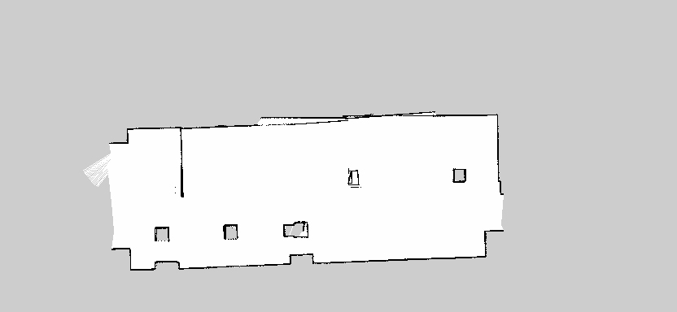

<p align="center">  
   
</p >

# <p align="center">Robotics Project</p >

<p align="center">Professor: Ralph SEULIN</p >  
<p align="center">Students: ZHU Chen,GU Heng</p >  

## Contents
1. [Introduction](#introduction)
2. [Move Robot](#Move-Robot)
3. [Mapping and Localization](#Mapping-and-Localization)
4. [Navigation](#Navigation)
5. [Follow waypoints](#Follow-waypoints)
6. [Conclusion](#Conclusion) 
7. [References](#References) 

<!-- END doctoc generated TOC please keep comment here to allow auto update -->

## Introduction

First of all, we are proficient in robot control methods through some basic courses. We need to know how robots build maps, locate, navigate and move autonomously between different waypoints. The main content of the project is to use Turtlebot3 Robot to complete the following challenges:  

- Create a script that moves the robot around with simple /cmd_vel publishing. See the range of movement of this new robot model.  
- Create the mapping launches, and map the whole environment. You have to finish with a clean map of the full cafeteria.  
- Setup the launch to be able to localise the Turtlebot3 robot.  
- Set up the move base system so that you can publish a goal to move_base and Turtlebot3 can reach that goal without colliding with obstacles.  
- Create a program that allows the Turtlebot3 to navigate within the environment following a set of waypoints. The 3 following spots are mandatory  

## Move robot  

The topic we used in order to control the velocities of the robot is /cmd_vel. This topic uses the geometry_msgs/Twist message. And this is the type of message that we will need to send to the topic to control the robot. The message contains 2 vectors: one for the linear velocities, and the other one for the angular velocities. Each of these vectors has its corresponding component in x, y, and z. However, what we need to take care of is only the linear x and angular z components, the ones that have an effect on a differential drive robot.
- Set a topic of /cmd_vel and movement speed and  angular speed  
```
def __init__(self):
        self._cmd_vel_pub = rospy.Publisher('/cmd_vel', Twist, queue_size=1)
        self._twist_object = Twist()
        self.linearspeed = 0.3
        self.angularspeed = 0.5
```  
- Set the speed of movement in each direction  
```
def move_robot(self, direction):
        if direction == "forwards":
            self._twist_object.linear.x = self.linearspeed
            self._twist_object.angular.z = 0.0
        elif direction == "right":
            self._twist_object.linear.x = 0.0
            self._twist_object.angular.z = -self.angularspeed
        elif direction == "left":
            self._twist_object.linear.x = 0.0
            self._twist_object.angular.z = self.angularspeed
        elif direction == "backwards":
            self._twist_object.linear.x = -self.linearspeed
            self._twist_object.angular.z = 0.0
        elif direction == "stop":
            self._twist_object.linear.x = 0.0
            self._twist_object.angular.z = 0.0
        else:
            pass
        
        self._cmd_vel_pub.publish(self._twist_object)
```  

## Mapping and Localization
### Mapping
First of all, we need to create a new package where we will put all the files related to navigation. Inside this new package, we need to create 2 new directories, launch and param. Then we need to create a launch file in order to start the slam_gmapping node.  
- Before calling the map program, we first need to run the robot control program:
```roslaunch turtlebot3_teleop turtlebot3_teleop_key.launch```  
- Call robot and gmapping in the map launch file
```  
<!-- Turtlebot3 -->
  <include file="$(find turtlebot3_bringup)/launch/turtlebot3_remote.launch" />

  <!-- Gmapping -->
  <node pkg="gmapping" type="slam_gmapping" name="turtlebot3_slam_gmapping" output="screen">
```  
Then we can proceed to start this launch file. We need to launch RViz in order to be able to visualize the mapping process. Afterward, we can start moving the robot around the environment in order to generate a full map. We end up with this:  

<p align="center">  
   
</p >  

Our next step is to save this map. Another of the packages available in the ROS Navigation Stack is the map_server package. This package provides the map_saver node, which allows us to access the map data from a ROS Service, and save it into a file. It will get the map data from the map topic, and write it out into 2 files, name_of_map.pgm and name_of_map.yaml. The PGM file is the one that contains the occupancy data of the map, and the YAML file contains some metadata about the map, like the map dimensions and resolution, or the path to the PGM file.  

<p align="center">  
   
</p >  

### Localization  

And after that, the next thing we'll need to do is to be able to localize the robot into that map. For that, we are going to use the amcl node from the Navigation Stack.  
The AMCL (Adaptive Monte Carlo Localization) package provides the amcl node, which uses the MCL system in order to track the localization of a robot moving in a 2D space. This node subscribes to the data of the laser, the laser-based map, and the transformations of the robot, and publishes its estimated position in the map. On startup, the amcl node initializes its particle filter according to the parameters provided.  
We need to create a new launch file in order to start the localization node.  
- Call the robot and the previously saved map
```
<include file="$(find turtlebot3_bringup)/launch/turtlebot3_remote.launch" />
    
  <arg name="map_file" default="$(find microproject1)/maps/my_map.yaml"/>
  <node name="map_server" pkg="map_server" type="map_server" args="$(arg map_file)" />
```
- Set the following parameters in the launch file in order to obtain accurate robot localization:  
    - min_particles  
    - max_particles  
    - kld_err   
    - update_min_d   
    - update_min_a  
    - resample_interval   
    - transform_tolerance   
    - gui_publish_rate   
Then we can launch RViz in order to be able to visualize the localization process. We end up with this:  

<p align="center">  
   
</p > 


## Navigation

In order to achieve autonomous navigation of the robot, we need to use a navigation stack. The navigation stack is a set of ROS nodes and algorithms that are used to automatically move the robot from one point to another, thereby avoiding all obstacles that the robot may encounter.  

<p align="center">  
   
</p >  

In order to realize the path planning of the robot, we need to use the 2D Nav target tool of the mobile robot, costmap, and calculate the trajectory. In order to achieve these goals, we need to use the move_base package. The move_base package contains the move_base node.  The move_base node is one of the major elements in the ROS Navigation Stack, since it links all of the elements that take place in the Navigation process. As shown below:  

<p align="center">  
   
</p >  

The move_base node implements SimpleActionServer and receives target information with geometry_msgs/PoseStamped messages. The following table describes the description of some topics subscribed and published by the move_base node.  

<p align="center">  
   
</p >   

If we need the robot to avoid obstacles to reach the designated place, we also need to use the following parameters:  
- **The Global Planner:** When the move_base node receives a new target, the target will be sent to the global planner immediately. Then, the global planner is responsible for calculating the safe path to reach the target posture. The path is calculated before the robot starts to move, so readings made by the robot's sensors during the movement are not considered. Every time the global planner plans a new path, the path is published to the /plan topic.  
- **The Local Planner:** Local planners can instantly recalculate the robot's path to prevent the robot from hitting the object, but still allow it to reach its destination. When the local plan is generated, it will be published to the topic named /local_plan.  
- **Global Costmap:** The global cost map is created based on the static map generated by the user. In this case, the initialization cost map provides width, height, and obstacle information.  
- **Local Costmap:** The local planner uses the local cost map to calculate the local plan, which is created directly based on the robot's sensor readings.
dwa_local_planner: The DWA local planner provides an implementation of the Dynamic Window Approach algorithm.  

<p align="center">
        <p align = "center">
          
           <br>
        <em> Global map&Local map</em>  
                                     
First, we use the roslaunch command to load the navigation program:  
&nbsp;&nbsp;&nbsp;&nbsp;&nbsp;&nbsp;&nbsp;```roslaunch microproject1 start_navigation.alunch```  
The following is an introduction to each topic called in the launch file:  
- Load the robot model:  
```<arg name="model" default="burger" doc="model type [burger, waffle]"/>```  
- Call the map we have created before：
```<arg name="map_file" default="$(find microproject1)/maps/my_map.yaml"/>```  
- Call related topics and required documents：
```
    <rosparam file="$(find microproject1)/param/costmap_common_params_burger.yaml" command="load" ns="global_costmap" />
    <rosparam file="$(find microproject1)/param/costmap_common_params_burger.yaml" command="load" ns="local_costmap" />
    <rosparam file="$(find microproject1)/param/local_costmap_params.yaml" command="load" />
    <rosparam file="$(find microproject1)/param/global_costmap_params.yaml" command="load" />
    <rosparam file="$(find microproject1)/param/move_base_params.yaml" command="load" />
    <rosparam file="$(find microproject1)/param/dwa_local_planner_params.yaml" command="load" />
```  
In the dwa_local_planner_params.yaml folder, we can control the robot's moving speed and rotation speed by changing the following parameters:  
```/acc_lim_x ,/acc_lim_th ,/max_trans_vel ,/min_trans_vel,/max_vel_x ,/min_vel_x ,/max_rot_vel,/min_rot_vel```  
After starting Rviz, in order to correctly navigate the robot, we basically need to use 3 elements of RViz:   
```
Map Display (Costmaps)
Path Displays (Plans)
2D Tools
```
For the map ,we need to set the topic to ```/move_base/global_costmap/costmap``` to visualize the global cost map and change the topic to ```/move_base/local_costmap/costmap``` to visualize the local costmap.For the path,we need to set the topic to ```/move_base/NavfnROS/plan``` in order to visualize the global plan and change the topic to ```/move_base/DWAPlannerROS/local_plan``` in order to visualize the local plan. Next we need to use the 2D Pose Estimate tool and 2D Nav Goal to set the initial position and goal.  

When the goal is set, the message will be sent to the ```/move_base/goal``` topic of its Action Server to send the pose goal to the ```move_base``` node. When the node receives the goal pose, it links to components such as global planner, local planner, recovery behavior and cost graph, and generates output, which is a speed command, and the message type is ```geometry_msgs/Twist```, and Send it to the ```/cmd_vel``` topic to move the robot.  

 <p align="center">
        <p align = "center">
        
            <br>
        <em> 2D Pose Estimate&2D Nav Goal</em>  
 
In the second way, we can send the target through the following command line instead of using 2D navigation target:  
&nbsp;&nbsp;&nbsp;&nbsp;&nbsp;&nbsp;&nbsp;```rostopic pub /move_base/goal move_base_msgs/MoveBaseActionGoal```  

<p align="center">  
   
</p >  

The third way is to send the gesture goal to the move_base node directly in the program by sending a message to the /move_base/goal topic of its Action Server.
```
# creates a goal to send to the action server
goal = MoveBaseGoal()
goal.target_pose.header.frame_id = 'map'
goal.target_pose.pose.position.x = 1.16
goal.target_pose.pose.position.y = -4.76
goal.target_pose.pose.position.z = 0.0
goal.target_pose.pose.orientation.x = 0.0
goal.target_pose.pose.orientation.y = 0.0
goal.target_pose.pose.orientation.z = 0.75
goal.target_pose.pose.orientation.w = 0.66
```  
When the node receives the target pose, it links to components such as global planner, local planner, recovery behavior, and cost graph, and generates output, which is a speed command, and the message type is geometry_msgs/Twist, and Send it to the /cmd_vel topic to move the robot.  
- create the connection to the action server:  
```client = actionlib.SimpleActionClient('/move_base', MoveBaseAction)```  
- sends the goal to the action server, specifying which feedback function to call when feedback received:  
```client.send_goal(goal, feedback_cb=feedback_callback)```  

Turtlebot3 is now able to navigate to different locations in the environment and follow a safe path without any obstacle collisions. Below is the demo video:  

<p align="center">
    https://www.loom.com/share/cb532c68fe7045049256a3f94e8591c6
  </p>


## Follow waypoints  

If you want to realize that the robot can move between the set fixed waypoints, you need to use the follow_waypoints package. The follow_waypoints package uses actionlib to send goals to move_base to realize autonomous navigation of the robot.  
The following table is the topic information that follow_waypoints needs to use:  

<p align="center">  
   
</p >  

It is the waypoint server that stores the destination point and route information in follow_waypoints. The initialization pose topic used to initialize the robot will forward the information to the waypoint server (amcl and follow_waypoints subscribe to this topic), and the message type is geometry_msgs / PoseWithCovarianceStamped. The waypoint server will store all waypoints and routes, and then provide them to the move_base node to start browsing all specified targets.  
- First we need to download the follow_waypoints package from Github:  
```gitclone https://github.com/danielsnider/follow_waypoints.git```  
- Before starting to launch follow_waypoints, you first need to launch the robot navigation program.  
```roslaunch <navigation package> < launch file.launch>```  
- After launching follow_waypoints, we use 2D Pose Estimate to determine the location of each target point，Note that we need to add a PoseArray element located in the theme/waypoints and change its name to WayPoints. It will display all the waypoints we have set from now on.  

<p align="center">  
   
</p > 

- Publishing in the path_ready topic, and then it will start sending the waypoints we created to the move_base node with the message type std_msgs/Empty. To start the path_ready topic, we execute:  
```rostopic pub /path_ready std_msgs/Empty -1```  

Now, the robot starts to move between fixed points, the following is the demo video link:  

<p align="center">
    https://www.loom.com/share/349588f17d89480584507c2960ca1556
  </p>

## Conclusion

We completed the robot simulation with Gazebo on The construt platform. In this project, we need to complete the five tasks of robot movement, map building, positioning, navigation, and waypoint navigation. The simulation environment we use is a Costa Coffe in Barcelona. In this environment, there are many obstacles, which makes the positioning and navigation of the robot difficult. But due to platform errors, our actual simulation environment is relatively simple. Through this project, we have mastered some basic knowledge about robots, especially the use of gmapping, amcl and move_base packages. The construct platform can very well allow us to complete the knowledge of learning robots without actual robots and space, and provide different simulation environments and different types of robots in each course, which can better help us Master the operation of different robots in different environments. But The construct platform also has some problems. Because it is a simulation platform, the platform will have problems that it cannot connect to the simulation environment and cannot log in, and when the network speed is not good, the simulation of the robot will be delayed, resulting in errors in the simulation results of the robot.  

## References

- [The Construct Platform](http://theconstructsim.com)  
- [WIKI ROS](http://wiki.ros.org/)  
- [Latest Course Support](https://get-help.robotigniteacademy.com)  


